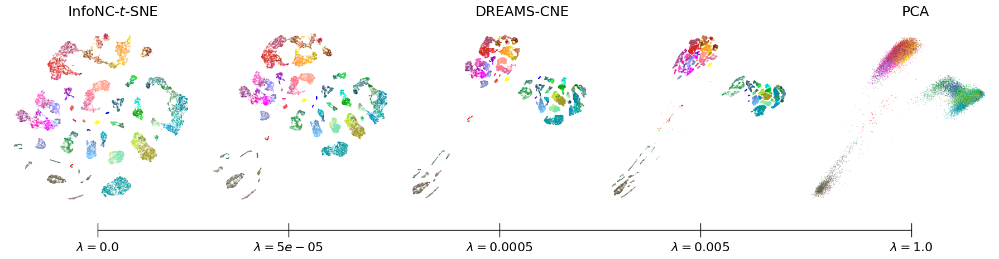
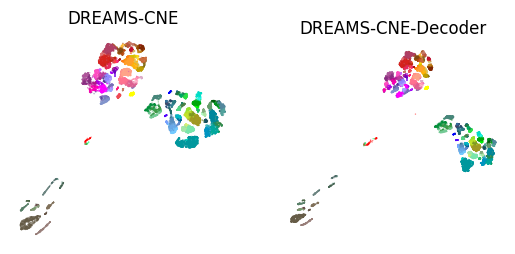

[](https://opensource.org/licenses/MIT)

# DREAMS-CNE
This repossitory contains the code of the methods DREAMS-CNE and DREAMS-CNE-Decoder presented in "DREAMS: Preserving both Local and Global Structure in Dimensionality Reduction".

DREAMS (Dimensionality Reduction Enhanced Across Multiple Scales) combines the local structure preservation of $t$-SNE with the global structure preservation of PCA via a regularization term that motivates global structure preservation. It provides a continuum of embeddings along a local-global spectrum with almost no local/global structure preservation tradeoff.

<p align="center">

This code builds upon [Contrastive Neighbor Embeddings](https://github.com/berenslab/contrastive-ne), which is the neighbor embedding method that DREAMS-CNE and DREAMS-CNE-Decoder is using.

# Installation
To use the method you must follow these steps:
````
git clone --branch tp --single-branch https://github.com/berenslab/DREAMS-CNE
cd DREAMS-CNE
pip install .
````

# Usage example
DREAMS-CNE has two types of regulatization. One with a precomputed embedding and one using a linear decoder (DREAMS-CNE-Decoder).

Here is an example on the Tasic et al. dataset[^tasic] (which is not part of this repository but the preprocessed data can be found [here](https://github.com/berenslab/rna-seq-tsne/tree/master/data/tasic-preprocessed)):
````python
import cne
import numpy as np
import matplotlib.pyplot as plt
from sklearn.decomposition import PCA

# Load data
tasic_data = np.load('data/tasic/tasic-pca50.npy')
# Scaled first 2 PCs
tasic_pca2 = tasic_data[:, :2]
tasic_reg_emb = tasic_pca2 / tasic_pca2[:,0].std()
# Initial decoder weights
pca = PCA(n_components=2)
tasic_pca2_sk = pca.fit_transform(tasic_data)
tasic_init_weights = pca.components_.T /  tasic_pca2_sk[:,0].std()

# DREAMS-CNE
 embedder_cne = cne.CNE(negative_samples=500,
                        n_epochs=750, 
                        regularizer=True, 
                        reg_embedding=tasic_reg_emb, 
                        reg_lambda=0.0005, 
                        reg_scaling='norm')
embd_cne = embedder_cne.fit_transform(data)

# DREAMS-CNE
embedder_cne_dec = cne.CNE( negative_samples=500,
                            n_epochs=750,
                            decoder=True, 
                            reg_lambda=0.001)
embd_cne_dec, dec_weights = embedder_dec.fit_transform(tasic_data, init_weights=tasic_init_weights)

# Plotting
embeddings = [('DREAMS-CNE', embd_cne), 
              ('DREAMS-CNE-Decoder', embd_cne_dec)]

tasic_colors = np.load('data/tasic/tasic-colors.npy')

fig, ax = plt.subplots(1, 2)

for i, (name, emb) in enumerate(embeddings):
    ax[i].scatter(*emb.T, c=tasic_colors, s=1.0, alpha=0.5, edgecolor='none')
    ax[i].set_title(name)
    ax[i].set_aspect('equal')
    ax[i].axis('off')
````
<p align="center">

# References
[^tasic]: Bosiljka Tasic, Zizhen Yao, Lucas T Graybuck, Kimberly A Smith, Thuc Nghi Nguyen, Darren Bertag-
nolli, Jeff Goldy, Emma Garren, Michael N Economo, Sarada Viswanathan, et al. Shared and distinct
transcriptomic cell types across neocortical areas. Nature, 563(7729):72–78, 2018.